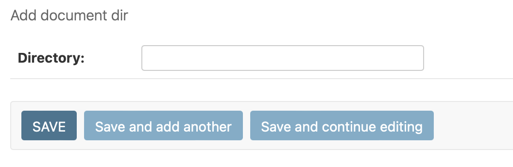
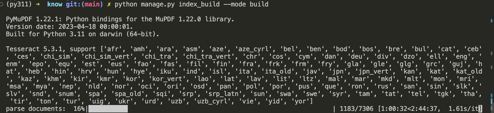
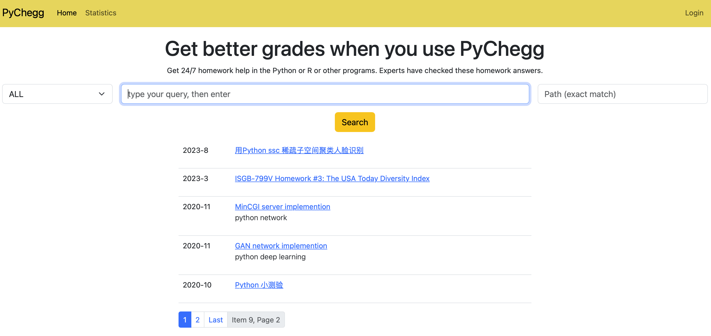
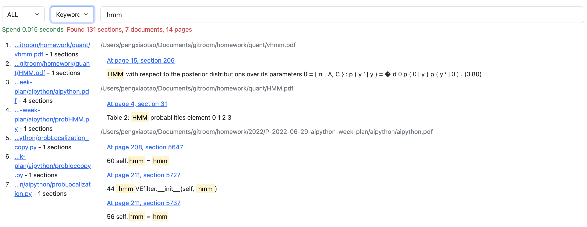
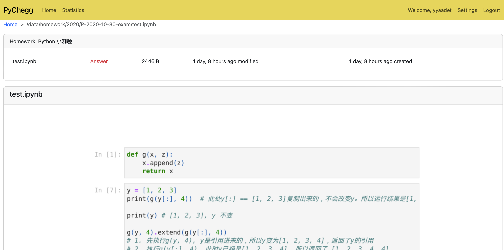
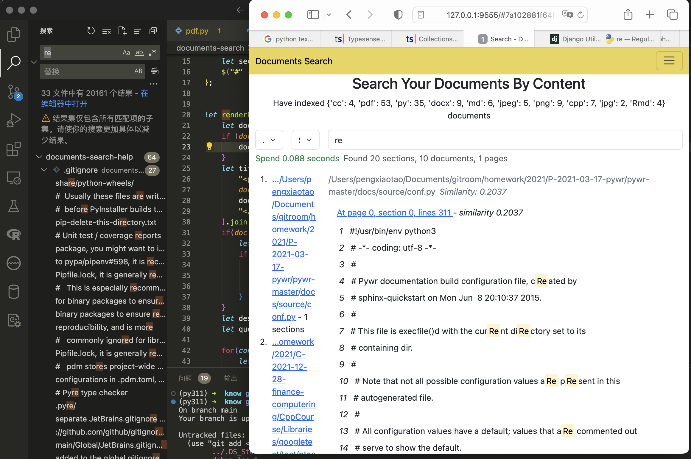

# documents-search-help

Help of documents search engine and some news. We are developing a new native documents search engine. Our goal is rebuild a new native documents search engine with AI (Large Language Model and transformer-based NLP) technology.

[Chinese](./zh.md)

# Features

- Privacy. 
- Full control by yourself.
- Quickly.
- More Accuracy than simple keyword search.
- Support py, pdf, png, jpeg, jpg, rmd, docx. And more latter...

# Usage

## Add directory to engine

Login to admin site, then add your directory.

## Index all directory

Open a terminal, cd project directory, input `python manage.py index_build --mode build`

## Search

Open site [http://127.0.0.1:9555](http://127.0.0.1:9555), type your query in the input box. Meanwhile, you can select different file extension and search method. The file extensions include py, pdf, png, jpeg, jpg, rmd, docx. The search methods include **keyword** and **sematic**.

## Search Result

## Result detail and files in the same parent directory

# Compares

## VS vscode search

Which is your like?

# How to Get it?

The product **documents-search** is not open source. You should buy it. After buy, you can get services as follow:

1. 1 year or more training and support.
2. Bug fix.
3. Free upgrade.
4. Free installation.

# Contact Us

- Email: yyaadet@qq.com
- Weixin MP:

    

# Our other projects

- [m1 stable diffusion webui](https://github.com/yyaadet/m1-stable-diffusion-webui)

