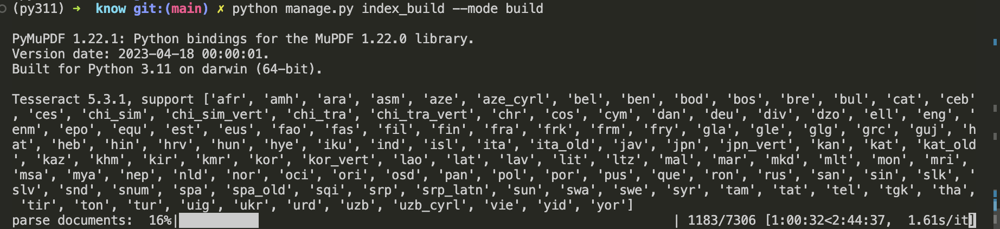
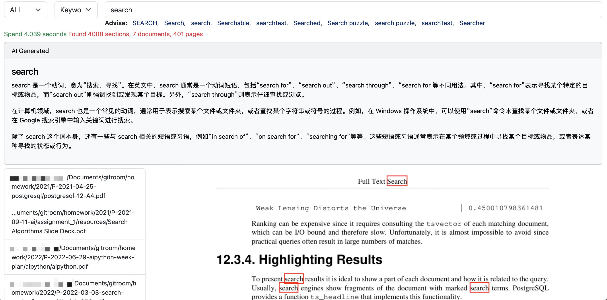

# documents-search-help

一个可以本地化部署的文档搜索引擎。我们的目标是借助新的AI技术（基于大模型与transformer-based的NLP技术）重构一个新的文档搜索引擎。

# 特性

- 私密，完全部署在本地，不需要联网也可以使用
- 完全自主控制
- 快
- 准确的关键词搜索，可以直接定位到文档具体的内容页
- 支持文件格式：py, pdf, png, jpeg, jpg, rmd, docx, md, ipynb；将来还会有更多格式支持

# 使用说明 

## 添加目录到索引库中

登陆管理后台，开始添加目录

## 建立索引

打开一个终端，进入项目目录，输入命令 `python manage.py index_build --mode build`

## 开始搜索

使用浏览器打开网站 [http://127.0.0.1:9555](http://127.0.0.1:9555)。在输入框可以输入关键词，选择文件类型与检索算法。

## 搜索结果

## 搜索详情页

# 从哪里可以得到这款软件?

这个产品 **documents-search** 并不是开源的，需要付费购买。购买后，可以获得如下的服务：

1. 1年的技术支持与培训服务
2. 问题修复
3. 免费升级
4. 安装服务
5. 永久使用

# 联系我们 

- Email: yyaadet@qq.com
- Weixin MP:

    

# 作者的其他项目

- [m1 stable diffusion webui](https://github.com/yyaadet/m1-stable-diffusion-webui)

